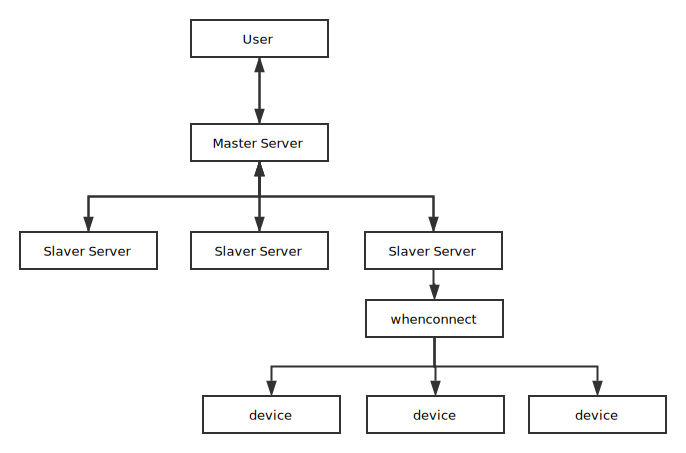

# BigBoss

> BigBoss is watching your android.

## 设计



[2rd RMS4A](https://github.com/williamfzc/RMS4A)

### 设备管理

- id、状态、机型信息
- slaver各自管理连接到自身的设备，并提供API供master调用
- master通过遍历slaver list得到总体的连接状况

```
{
    "code": 1000,
    "data": {
        "123.456.789.123": {
            "ip": "123.456.789.123",
            "status": true,
            "device_dict": {
                "code": 1000,
                "data": {
                    "123456F": {
                        "device_id": "123456F",
                        "device_status": "FREE",
                        "device_info": {
                            "device_name": "TEST ONLY"
                        }
                    },
                },
                "message": {}
            }
        }
    },
    "message": {}
}
```

### 通信

- slaver 与 master
    - master通过slaver暴露的restful API进行调用
        - 即时性的行为通过response直接反馈给master
        - 延时性的行为通过master的private API进行反馈

- server与device
    - `whenconnect`
    - `adb`

### 任务管理

公共部分：

- 设备状态更新（是否被占用）
- 任务状态更新（完成与否、执行情况）

基本设计：

- 通过master API新建任务
- 由master服务器向各slaver服务器分发python脚本，作为启动器
- slaver服务器启动该脚本并管理该进程生命周期
- 执行完成后通过private API更新master的任务状态

## 路线

### 第一期 设备管理

- slaver server
    - [x] 能够正常识别设备插拔
    - [x] 维持最新的设备列表
    - [x] 设备同步接口

- server设备同步
    - [x] slaver ip记录

### 第二期 任务

- [x] Python脚本分发与执行
- [ ] 任务流程管理与同步

## 依赖

- [tornado](https://github.com/tornadoweb/tornado)
- [requests](https://github.com/requests/requests)
- [whenconnect](https://github.com/williamfzc/whenconnect)
    - 用于即时设备管理

## 协议

[MIT](LICENSE)
